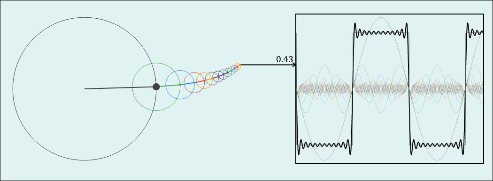
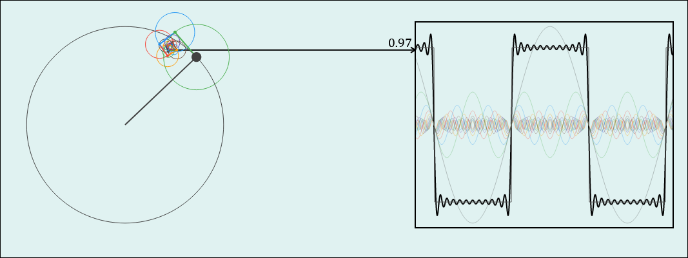

---  
share: true  
created: 2024-08-04T01:53  
updated: 2024-08-11T16:33  
---  
Khái niệm:: [Dao động tử](../%CE%9E%20Kh%C3%A1i%20ni%E1%BB%87m/V%E1%BA%ADt%20l%C3%BD/Dao%20%C4%91%E1%BB%99ng%20t%E1%BB%AD.md)  
> Một nhà vật lý lý thuyết trẻ xây dựng sự nghiệp của mình bằng việc làm việc với dao động tử điều hòa ở các cấp độ càng ngày càng trừu tượng hơn.  
 — [Sidney Coleman](https://en.wikipedia.org/wiki/Sidney_Coleman)  
  
[Why is the harmonic oscillator so important?](https://physics.stackexchange.com/q/159021/41634)  
["QFT is simple harmonic motion taken to increasing levels of abstraction"](https://physics.stackexchange.com/q/355487/41634)  
  
  
  
  
Các dao động tử là các vector trực giao trong không gian Hilbert, vốn là biểu diễn của các nhóm đối xứng  
