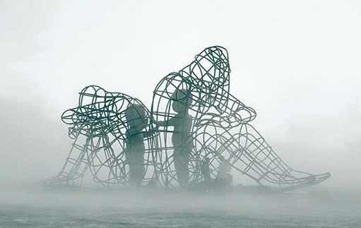

Năm mầu khiến người mù mắt.
Năm giọng khiến người điếc tai.
Năm mùi khiến người tê lưỡi.
Sải ngựa săn bắn,
Khiến lòng người hoá cuồng.

(Lão Tử, Đạo Đức Kinh)

Một trong những lý do quan trọng để tôi làm dự án Quả Cầu này là để làm rõ những quan điểm của Đạo giáo (và cả Phật giáo) theo kết quả khoa học.

Một mặt, tôi thấy các kết luận của Đạo giáo như đoạn trích phía trên đều hợp lý và hay. Nhưng mặt khác, có vẻ như tiềm tàng trong đó có gì đó kiêu kiêu và ngụy biện. Nhiều người dùng những chỉ trích "xưa như Trái đất" để cho rằng khoa học không thể với tới thứ họ thấy, và điều đó làm họ không thấy được khoa học hiện nay đã làm được những gì và đi được những đâu (the state of the art of science). Sau mấy trăm nay như vậy mà vẫn cho rằng tư duy lý tính vẫn dậm chân tại chỗ thì tài thật. Trang Tử mà nghe được chắc phá ra cười vì họ không thấy rằng trong cái này đã có cái kia, cái này đi đến cùng sẽ hóa thành cái kia. Chỉ cần tinh ý một chút sẽ thấy những gì họ nói đều dựa trên những ý niệm khoa học đã nhìn ra từ lâu.

Nhưng làm sao lại có thể trách họ được, khi "phe" khoa học thậm chí còn chẳng trình ra cho họ thứ họ cần thấy? Rõ ràng, "phe" Đạo giáo vẫn có cái lý của họ, và với trình bày kiến thức như hiện nay, thì không thể trách họ cho rằng tư duy khoa học là vô ích. Làm sao lại có thể nói là họ kiêu kiêu và ngụy biện, khi mục đích của Đạo giáo là để hết kiêu kiêu và ngụy biện?

Tức là cả hai bên nhìn nhau, khó chịu với nhau, nhưng đều không thể chỉ ra được bên kia sai ở đâu. Họ càng tìm ra lỗi sai, thì lỗi sai đó đều biến đi thành một hình thù khác, một lối diễn đạt khác. Cứ như thế mà luẩn quẩn không tới đâu. Thứ duy nhất còn đọng lại là một sự không thỏa mãn không thể giải tỏa được.

Khi tôi nói là dự án này làm rõ những quan điểm của Đạo giáo theo kết quả khoa học, có phải ý tôi là khoa học đã đủ khả năng để giải thích được toàn bộ? Tôi xin được phép nói là có. Tuy nhiên, để có thể giải thích một cách triệt để và thỏa mãn cả hai bên, thì cần phải chú ý vào những lĩnh vực mà thị trường sách phổ biến kiến thức khoa học hiện nay chưa chú trọng để giới thiệu. Mà nếu thị trường đó đại diện cho những gì người trong ngành muốn người ngoài ngành biết, thì nó cũng có thể xem như những gì người làm khoa học nghĩ về những gì họ đang làm. Nói cách khác, chính những người làm về nó cũng cần thay đổi tư duy của mình. Còn nếu không, thì dù có thêm vô số những cuộc "đối thoại Đông - Tây" nữa, tôi nghĩ cũng sẽ không đi được tới đâu cả. Phải nhấn mạnh đến sự ghi nhớ, chú ý, và biến đổi nghĩa của từ mới mong tìm được một đột phá nào đó.

Kiến thức về khoa học lạc hậu

Cứ dựa vào lý lẽ khó giải thích, trong khi nếu đã nói là nắm được nguyên lý thì việc giải thích có gì đâu mà khó.

Đây là những bài viết thể hiện những tìm tòi của tôi để đi tới đột phá đó:

- Tại sao "đúng sai miễn bàn" lại không Ăn ż là quan điểm của Đạo giáo?
- Tại sao Đạo giáo lại đề cao sự học?
- Khi đạo sĩ gặp rối loạn tâm lý
- Rắc rối của từ bi
- Tóm tắt cuốn Vô vi như là một ẩn dụ tri nhận và lý tưởng tinh thần thời Chiến Quốc
- Phản biện cuốn Cuộc cách mạng một cọng rơm
- Bài tiếng Anh: Connections between

⬛ Về mặt triết học

- Tâm lý học hoặc khoa học nhận thức sẽ nói gì về quan niệm "chỉ có cảm nhận trực tiếp mới cho ta hiểu biết trọn vẹn"?
- Ngôn ngữ học sẽ nói gì về quan niệm "ngôn ngữ không thể diễn đạt chính xác"?
- Khoa học chính trị sẽ nói gì về các quan điểm của đạo gia và pháp gia?
- Logic học sẽ nói gì về tứ cú trong đại thừa?
- Các trường phái triết học khác nhau nói gì về quy luật nhân quả? Về thuyết âm dương? Về thuyết nhất nguyên?
- Thông diễn học sẽ nói gì về việc nhận biết, đánh giá xem một người có ngộ đạo/giác ngộ hay không?
- Vật lý sẽ nói về sắc như thế nào?
- Duy thức học và khoa học nhận thức giống và khác nhau thế nào?
- Trường phái hậu hiện đại sẽ nói gì về phật giáo? Diễn ngôn giải thoát và giác ngộ hoạt động như thế nào?

⬛ Về mặt thực hành

- Có những cuộc đối thoại nào giữa những người theo nguyên thuỷ và những người theo đại thừa nào về mâu thuẫn giữa hai phái mà làm cho mình học hỏi được nhiều nhất?
- Thiền trong thiền tông, thiền trong nguyên thủy giống và khác nhau thế nào? Chánh niệm của phật giáo và chánh niệm trong quan điểm của Jon Kabat-Zinn khác nhau thế nào?
- So với các hình thức trị liệu tâm lý khác, việc tu tập có hiệu quả như thế nào trong việc chữa lành?
- Nếu như việc sử dụng triết học phương Đông cũng tuỳ vào sự phù hợp thời điểm, thì thời điểm nào là nó không phù hợp?
- Các tôn giáo khác như Công giáo học tập Phật giáo như thế nào?

Tôi nghĩ nếu họ cảm thấy khoa học không bao giờ, xin mời họ thử một ngày làm những công việc liên quan đến nhân đạo. Ví dụ: công tác xã hội

# Tránh từ Hán Việt

Không dùng duyên, mà dùng điều kiện

Không dùng khổ, mà dùng không như ý

8 điều đúng đắn

4 sự thật

Đại thừa và Nguyên thuỷ đều cùng muốn theo ý Phật tổ

Khi nào một thứ là duyên. Khi nào một thứ không phải là duyên

Thiếu cọ xát

|   |   |   |
|---|---|---|
||Tiểu thừa|Đại thừa|
|Quan điểm tu|Tu theo La hán: cứu giúp chúng sinh ko phải là trách nhiệm|Tu theo Bồ tát: có trách nhiệm|
|Nơi tu|Xuất thế: Đi ra khỏi nơi dơ|Nhập thế: Ở trong nơi dơ mới là giác ngộ|
|Luân hồi|Không luân hồi. Chết là hết|Ở trong thế gian, trong khổ đau để thoát khổ đau|
||Phật là có thật, và chỉ có một|Nhiều Phật, nhiều Bồ Tát|
||Không quan tâm đến thế giới mơ hồ||
||Ngã không, pháp có|Ngã, pháp đều không|
|Niết bàn|là cảnh giới tuyệt đối vắng lặng, giải thoát, không còn khổ đau|là cảnh giới hoạt động trong khổ đau mà lòng không nhiễu động|
|Ẩm thực|Ai cho gì ăn nấy, miễn là bản thân mình ko giết thì ăn|Ăn chay trường (phát tâm với cả động vật)|

Hết thảy thực không phải thực

Cũng vừa là thực, cũng vừa không phải thực

Không phải thực, không phải không phải thực

Ấy gọi là Pháp của chư Phật

Có hai mâu thuẫn chính: giữa phật giáo nguyên thuỷ với đại thừa, và trong thiền tông

Tùy nhiên những người thực hành đi một hồi sẽ thấy những gì Đạo gia nói là có lý

Anh đang uống bia sang bia đang uống em vậy.

[Buddhism, The only real science](https://www.budsas.org/ebud/ebdha264.htm), [Đạo Phật giàu tính khoa học hơn khoa học hiện đại](https://www.facebook.com/notes/m%E1%BB%97i-tu%E1%BA%A7n-1-c%C3%B4ng-vi%E1%BB%87c/%C4%91%E1%BA%A1o-ph%E1%BA%ADt-gi%C3%A0u-t%C3%ADnh-khoa-h%E1%BB%8Dc-h%C6%A1n-khoa-h%E1%BB%8Dc-hi%E1%BB%87n-%C4%91%E1%BA%A1i/703813189791426)

Rất mong nhận được sự quan tâm, nhận xét, giúp đỡ của mọi người.

Ngăn chặn bạo hành trẻ em

(Mình nói lời này không phải với tư cách admin, mà chỉ là thành viên mà thôi.)

Nhiều bạn trong đây chắc sẽ cảm thấy lạ khi mình lập ra nhóm triết phương Đông mà tư duy lại sặc tính phương Tây. Chính xác, đây chính là điều các bạn đang căm ghét. Các bạn cho rằng tư duy Tây phương là lầm lạc, là lạc trong mê cung, thì yep, mình sẽ làm đúng như vậy. Mình cho rằng, các bạn thật ra chỉ đang sợ hãi bước vào mê cung mà thôi. Các bạn gọi tư duy của mình là gì cũng được: thiền, ngộ, đạo, v.v. Nếu các bạn quả thật có thiền, ngộ, đạo, thì tại sao mê cung lại khiến các bạn sợ đến như thế? Vì nếu các bạn không sợ mê cung và dám bước vào trong đó, thì các bạn cũng chẳng lấy làm phiền lòng khi người khác cũng ở trong mê cung.

Các bạn muốn cảnh tỉnh về tác hại của tư duy phương Tây? Mình cũng thấy những tác hại của nó, và mình cũng đồng ý với các bạn về sự cảnh tỉnh này. Nhưng mình nói thật lòng thế này: cách các bạn làm sẽ không đi tới đâu. Các bạn muốn phê phán nó, thì ít nhất các bạn cũng phải hiểu nó nói gì về chính mình đã. Thứ các bạn mô tả về tư duy phương Tây, bản thân nó không mô tả mình như vậy. Với nó, thứ các bạn đang mô tả là hời hợt, thô sơ, nông cạn, méo mó. Nó không phải đồ ngu, và nó luôn luôn phản tư chính mình, luôn luôn phê phán chính mình. Chỉ cần một chút xíu xem thường nó thôi, thì chính các bạn đã trở thành nạn nhân của nó rồi. Các bạn phải luôn luôn xem trọng nó, như thể phương Đông và phương Tây ngang bằng nhau, như thể phương Đông và phương Tây là một. Chỉ có như thế, các bạn mới thoát khỏi được "tư duy phương Tây".

Trong cuộc chiến giữa (một cuộc chiến mà tôi đến giờ vẫn không hiểu tại sao lại cí mặt, không biết "phe" nào đã khởi xướng nó), thì tư duy phương Tay chưa bao giờ làm tôi thất vọng Ngược lại, tôi thấy "phe" phương Đông như đang dựng một bù nhìn rơm rồi đấm lung tung vào đí

- Những cách hiểu sai về Đạo, và bản chất của sự nhập nhằng đó (Đạo giáo và ngữ nghĩa học)
- Mối tương tác của Đạo giáo với rối loạn tâm lý (Đạo giáo và tâm lý học trị liệu)
- Bản chất của "Đạo khả đạo phi thường đạo" (và các quan niệm khác của Đạo giáo) là gì? (Đạo giáo và khoa học nhận thức